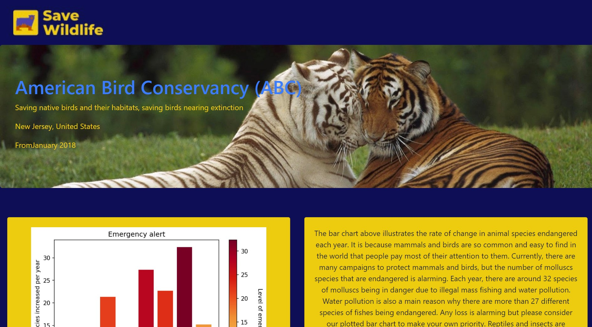
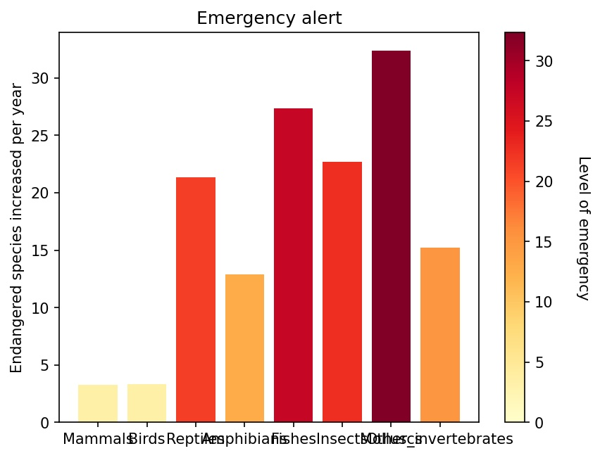
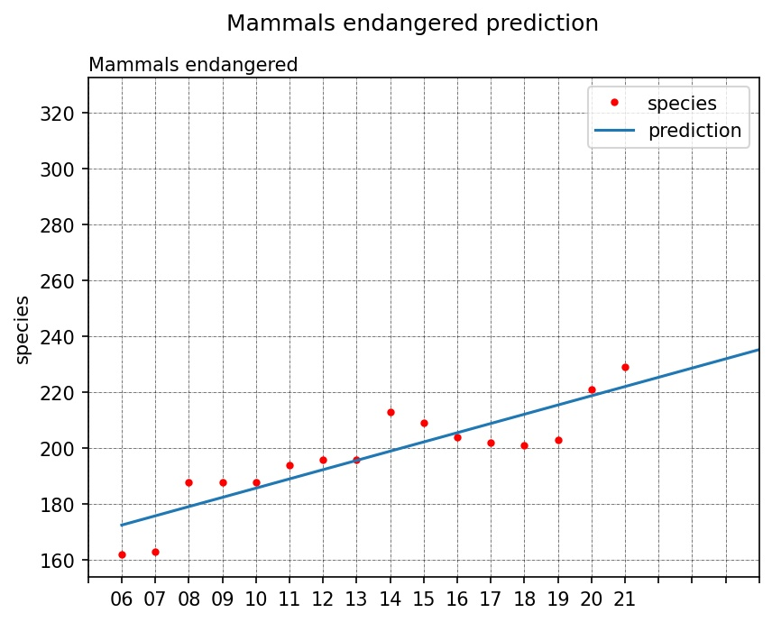

# Save Wildlife

  
  
  

## Inspiration
Based on the zoo theme provided and underfunding of animal welfare around the world during COVID-19 pandemic, we decided to build a website that provides both NGOs and users with essential statistics, predicting data about animal populations. So, they can raise awareness about nature then pay attention to natural activities.

## What it does
- The website is made to display a **Linear Regression** prediction about the number of endangered species of animals.
- Achieved a **91%** accuracy rate in predicting endangered mammals in 2022.

## What we used
- Backend: Python, scikit-learn, NumPy, pandas, matplotlib
  - Apply *linear regression* model to predict the endangered animal species from 2022 to 2030
  - Compare the rate of change in 8 species and make a comparison by *matplotlib*.
- Frontend: HTML, CSS, JavaScript
- Integrate Python and HTML: Flask
- Microsoft-Azure Wix Logo Maker

## Challenges we ran into
- Unfamiliar with displaying a graph using Python.
- Implementing an image from Python onto an HTML webpage.
- Formatting and styling the website.

## Accomplishments that we're proud of
- Figure out how to build a linear regression model in Python.
- Figure out how to plot a bar chart with a color bar based on the quantities’ values.
- Learn to edit a large template.
- Deploy code to get an image file in HTML.
- Add images and text into one section onto an HTML webpage.

